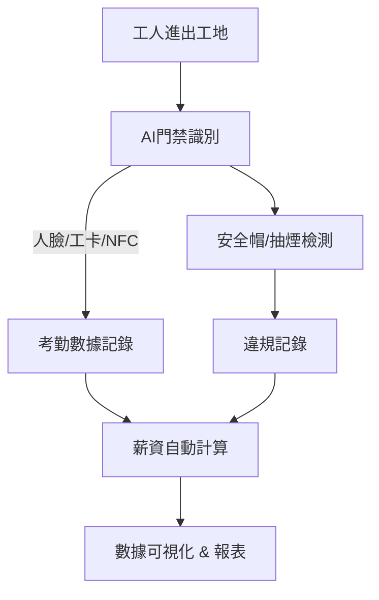

# 改進後簡報建議稿

---

## 1. 專案定位

**建築工地鐘點工智慧管理平台**

* 聚焦「多工班、多工種、多時段」的複雜工地用工場景。
* 解決施工方與工班的雙向痛點：考勤、薪資、合規、效率。

---

## 2. 行業背景與市場痛點

### 甲方（施工方）痛點：

1. **計時與結算困難**：工種繁多，人工統計誤差大。
2. **出勤管理不透明**：難以及時掌握工地人員進出。
3. **合規與保險壓力**：缺乏可追溯的工時記錄。

### 乙方（工班/工人）痛點：

1. **工資糾紛頻繁**：工時不透明，薪資易爭議。
2. **缺乏公平保障**：工資標準不一，待遇不透明。
3. **接單效率低**：依靠人脈接活，效率不高。

---

## 3. 差異化對比

| 項目       | 家政鐘點工平台 | 工地鐘點工平台（本方案）  |
| -------- | ------- | ------------- |
| **需求場景** | 單一家庭    | 多工班、多工種、多時段   |
| **考勤方式** | 簡單記錄    | 人臉/NFC/工卡精準記錄 |
| **薪資結算** | 時薪簡單計算  | 工時自動結算、工資透明   |
| **合規性**  | 無強制要求   | 勞務合規、政府檢查追蹤   |
| **安防檢測** | 無       | 安全帽、抽煙等 AI 偵測 |

**優勢亮點**：精準考勤 + 自動薪資 + 合規追蹤 + 違規檢測

---

## 4. 系統核心功能模組

1. **人員管理**：工人身份、工卡、人臉資料統一管理。
2. **門禁監控**：人臉識別 + 工卡 + NFC，實現進出追蹤。
3. **考勤與薪資**：自動計算工時，薪資即時計算。
4. **違規檢測**：未戴安全帽、抽煙等行為即時記錄並關聯薪資。
5. **數據統計**：工時、薪資、違規記錄全景化呈現。

---

## 5. 系統流程圖

---

## 6. 技術架構支撐

* **AI 視覺**：人臉識別、安全帽/抽煙檢測。
* **IoT 傳感器**：實時出入記錄。
* **資料庫（openGauss）**：工時、薪資、違規數據可追溯。
* **AI 推理引擎（MindSpore / MindSpeed）**：毫秒級響應，邊緣設備可部署。

---

## 7. UI 範例頁框

### (1) 工人端 APP

* **首頁**：今日工時、薪資估算、工地排班。
* **違規提醒**：提示未戴安全帽記錄。
* **工資記錄**：歷史薪資明細。

### (2) 管理端後台

* **考勤總覽**：工地進出人員名單。
* **違規統計**：違規事件數據面板。
* **薪資結算**：各工班工資結算狀態。

---

## 8. 未來展望

* **AI 預測工班需求**：依施工進度自動推算人力需求。
* **工時不可篡改**：確保薪資與合規透明。
* **智慧工地聯動**：結合 IoT，形成「智慧工地 + 勞務管理」一體化方案。

---

## 9. 總結

本方案以「計時精準、結算自動、合規透明」為核心，打造 **建築工地鐘點工智慧管理平台**，結合 AI + IoT 技術，解決工地用工雙方痛點，並與傳統家政平台形成差異化優勢，具備強市場推廣潛力。
